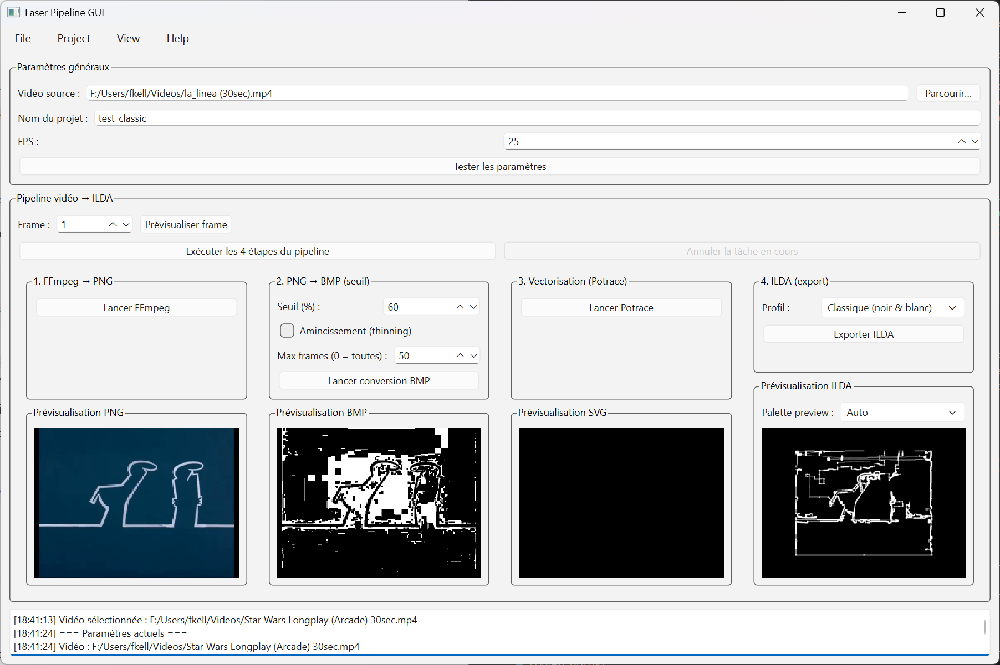
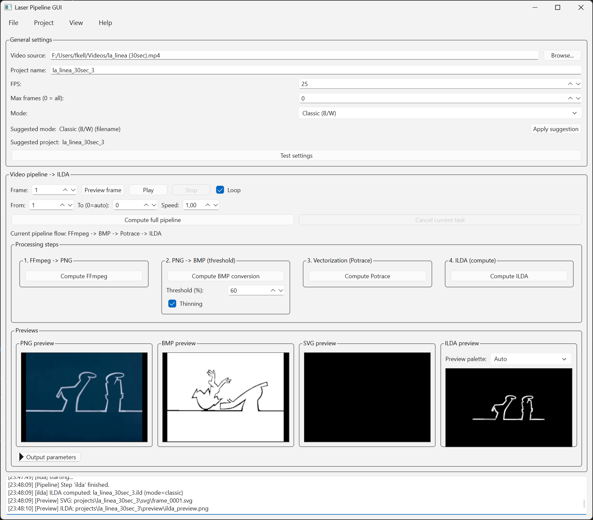
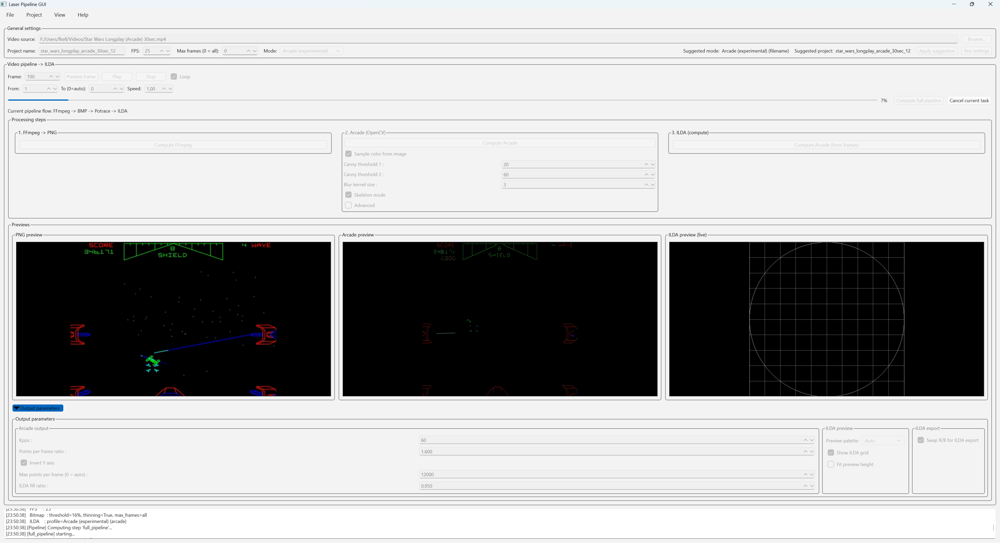

# Laser Pipeline GUI
Experimental PySide6 GUI that converts video frames into ILDA laser animations.



## Modes

### Classic (B/W)
Classic mode runs the full pipeline: FFmpeg -> Bitmap -> Potrace -> ILDA.



### Arcade (experimental)
Arcade mode skips Bitmap and Potrace and computes ILDA directly from frames
using the OpenCV-based line extraction step.



## Pipeline overview
1. **FFmpeg**: extract PNG frames from a video.
2. **Bitmap (ImageMagick)**: convert PNG -> BMP with thresholding and optional thinning.
3. **Potrace**: vectorize BMP -> SVG.
4. **ILDA export**: generate a `.ild` file from the SVG frames (classic mode),
   or from arcade line extraction (arcade mode).

## Configuration
External tool paths and the projects root are configured in `core/config.py`:
`FFMPEG_PATH`, `MAGICK_PATH`, `POTRACE_PATH`, `PROJECTS_ROOT`.

## Settings persistence
UI values are stored per project in `projects/<project>/settings.json`. The
file is saved when you:
- run the full pipeline
- export ILDA
- apply suggestions
- close the app

When you open a project folder, settings are loaded automatically if the file
is present.

## Project layout
```text
core/
  config.py
  ffmpeg_extract.py
  bitmap_convert.py
  potrace_vectorize.py
  ilda_export.py
  ilda_writer.py
  ilda_profiles.py
  ilda_preview.py
  pipeline/
    base.py
    ffmpeg_step.py
    bitmap_step.py
    potrace_step.py
    ilda_step.py
    arcade_lines_step.py
    full_pipeline_step.py

gui/
  main_window.py
  pipeline_controller.py
  preview_widgets.py
  controllers/
  services/
  ui/

projects/
  <project_name>/
    frames/
    bmp/
    svg/
    preview/
    ilda/
    <project_name>.ild
    settings.json
```

## Run
```bash
python gui_main.py
```

## Dependencies
Python >= 3.11 and these Python packages (see `pyproject.toml`):
`PySide6`, `opencv-python`, `numpy`, `svgpathtools`, `pillow`.

You also need `ffmpeg`, `ImageMagick`, and `potrace` installed and configured
via `core/config.py`.
